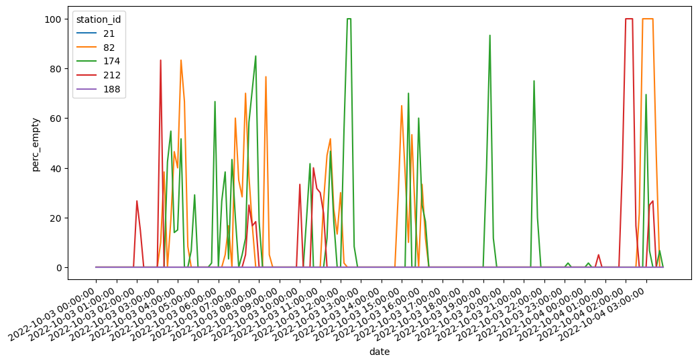

# Bicis BA

# Introducción

En 2019 la empresa brasilera Tembici ganó la licitación para operar el sistema de bicicletas compartidas de la ciudad de Buenos Aires, conocido como **EcoBici**, por 10 años. Los usuarios se deben registrar con tarjeta de crédito desde el sitio web para poder acceder al sistema. Luego, la aplicación [BA Ecobici](https://baecobici.com.ar) permite retirar bicicletas en cualquiera de las más de 200 estaciones repartidas en la ciudad.

{height=300px}

En la captura anterior de la aplicación podemos ver las estaciones cercanas a la sede en Paseo Colón de FIUBA. Se le indica al usuario la cantidad de bicicletas disponibles, y al hacer click, la cantidad de lugares disponibles para dejar una bicicleta, así quienes tengan que dejar una bicicleta tomada en otra estación saben si pueden dejarla ahí.

Sin embargo, esta información es una captura instantánea de las estaciones. Revisando la imagen anterior, vemos que son pocas las estaciones cercanas a la facultad, sumando en su máxima capacidad menos de 100 bicicletas en conjunto. En los horarios donde materias de concurrencia masiva terminan en FIUBA, este número difícilmente alcance la potencial demanda, más aún considerando que difícilmente las estaciones están en su máxima capacidad. Entonces alguien que sale de cursar podría mirar la aplicación, ver que hay varias bicicletas disponibles, dirigirse hacia una estación y al llegar, encontrarse con que no hay más bicicletas, habiendo más gente que al salir de cursar haya hecho lo mismo. También podría generar dinámicas de subutilización del sistema: nadie intenta conseguir bicicleta porque asume que se va a repetir la situación anteriormente descripta.

La propuesta del presente proyecto es resolver el problema anteriormente descrito, aumentando las capacidades de la aplicación móvil BA Ecobici. Se plantea informar al usuario sobre cuál es la estación que mejores probabilidades de conseguir una bicicleta le otorguen. Complementariamente, informar sobre los tiempos de espera de cada estación.

# Ciencia de datos

## Descripción del problema
Cuando buscamos una bicicleta desde la aplicación tenemos distintas estaciones disponibles, pero debido al tiempo que nos toma llegar hasta el lugar pueden haber variado su estado desde que lo vimos en la app.

Para ayudar en la toma de decisiones proponemos dos modelos, basándonos en datos recolectados de la API de transporte de bicicletas. Un modelo que indique la probabilidad de encontrar una bicicleta disponible al llegar a las distintas estaciones disponibles. Un modelo que estima cuántos minutos faltan para que llegue la próxima bicicleta cuando la estación está vacía.
## Análisis exploratorio de datos
### Variables disponibles
Las variables importantes que utilizamos en los modelos son:

 - **last_reported** timestamp del momento en que se reportan los datos
 - **station_id** identificador de las estaciones
 - **num_bikes_available** número de bicicletas disponibles
 - **num_bikes_disabled** número de bicicletas deshabilitadas
 - **num_docks_available** número de espacios disponibles para estacionar
 - **num_docks_disabled** número de espacios deshabilitados para estacionar

### Promedios por estaciones
Tomando los datos de octubre del 2022 para todas las estaciones calculamos los promedios de cada una de las variables. Después analizamos sus valores agregados y distribuciones.

|                 var |   min |    max |  mean |   std |
|--------------------:|------:|-------:|------:|------:|
| num_bikes_available | 1.217 | 24.798 | 7.241 | 4.132 |
|  num_bikes_disabled | 0.074 |  2.759 | 1.035 | 0.529 |
| num_docks_available | 1.173 | 25.907 | 9.689 | 4.885 |
|  num_docks_disabled | 0.000 |  0.113 | 0.002 | 0.010 |
|     bikes_available | 0.548 |  1.000 | 0.913 | 0.084 |

También se creó la variable bikes_available que calcula el porcentaje de tiempo que una estación tuvo al menos una bicicleta disponible.
En promedio hay aproximadamente 7 bicicletas por estación, con bastante variación entre estaciones, y normalmente una deshabilitada.
Se ve que casi nunca hay espacios para estacionar deshabilitados, y en promedio hay 9 espacios disponibles para estacionar.
Finalmente el 91% del tiempo las estaciones tienen bicicletas disponibles, lo que nos dejan con cerca de un 9% del tiempo con estaciones vacías.

### Variación de bicicletas diarias
Tomando 5 estaciones al azar, vemos la disponibilidad de bicicletas promedio. Se puede ver que algunas estaciones tienen menos bicicletas disponibles en promedio, y que los máximos y mínimos se dan en momentos diferentes.

{width=500px}

### Porcentaje de tiempo vacía
Tomando la primera semana de octubre se trajo el porcentaje de tiempo que la estación estuvo vacía por hora. Se puede ver que estaciones como la 188 siempre tiene bicicletas disponibles, mientras que la 174 pasa más tiempo vacía. También se ve que la disponibilidad baja en distintos momentos para las diferentes estaciones.

{width=500px}

### Evolución de bicicletas
Se armó un conjunto de datos con la cantidad de bicicletas disponibles después de diferentes periodos de tiempo. En el siguiente gráfico se compara la cantidad de bicicletas disponibles y la que quedaron después del periodo de tiempo, se puede ver una relación lineal con bastante variabilidad.

{width=500px}

### Diferencia de bicicletas
A partir del conjunto de datos anterior se calculó la diferencia entre las bicicletas iniciales y las que quedaban en la estación, se puede ver que la diferencia de bicicletas se distribuye normalmente centrada en cero.

{width=500px}

### Diferencia de bicicletas en el tiempo
Se tomó el valor absoluto promedio de los cambios de bicicleta para distintos minutos desde el último reporte de la estación. Se ve que la diferencia de bicicletas crece mientras mas minutos pasan.

{width=500px}

## Modelo de disponibilidad
### Conjunto de datos
Para armar el conjunto de datos tomamos los siguientes estados reportados de cada estación, agregando los minutos pasados como característica y si hay bicicletas disponibles como valor a predecir. El resultado fue un dataset desbalanceado donde hay aproximadamente un 8% de valores negativos contra un 92% de valores positivos.

### Métricas y modelos
Para analizar el desempeño de los modelos probados miramos la matriz de confusión. El peor escenario posible es recomendar una estación y que cuando el usuario llegue no haya bicicletas disponibles, entonces buscamos mantener una baja tasa de falsos positivos.
Como eran muchos datos también se tuvo en cuenta el tamaño de los modelos y el tiempo de entrenamiento.
La hora y el día de la semana se transformaron usando one hot encoding, donde fuese necesario, y las variables numéricas se estandarizaron.
Se probaron redes neuronales, random forest y lightgbm. El desempeño de los modelos era similar, pero por el tiempo de entrenamiento y mejora, elegimos lightgbm.
Todos los modelos permiten agregar pesos a las muestras, de esta manera le damos más importancia a los casos negativos, para de esta manera reducir los falsos positivos.

{width=200px}

Conseguimos una tasa de falsos positivos de menos del 1%, con una precisión en la disponibilidad del 99.96%.

### Estaciones como features vs estaciones como modelos
Las estaciones se pueden usar como features categóricas dentro de los modelos o tener modelos separados por cada estación. Usar las estaciones como features empeoraba los falsos negativos en un 50%, además de que el modelo tardaba 8 veces más en entrenar por la cantidad de datos, por eso decidimos usar las estaciones como modelos separados.

{width=200px}

### Shap values
Los Shap values permiten darle explicabilidad a los modelos complejos como light gbm. El valor medio de los shap values indica qué características están teniendo más importancia en el modelo para dar un resultado. Tomando los shap values sobre los modelos de 3 estaciones al azar, se puede ver que lo que más considera el modelo es la cantidad de bicicletas disponibles, junto con el momento de la consulta y el tiempo hasta la estación.

{width=450px}

## Modelo de tiempo estimado de arribo
### Conjunto de datos
Para armar el conjunto de datos tomamos el mínimo de los siguientes estados que tenían más bicicletas que el estado actual, cuando la estación está vacía, de ahí se obtuvieron los minutos hasta el próximo arribo que se tomó como el valor a predecir.

### Modelos y métrica
Se usó el error absoluto medio para evaluar, de esta manera era fácil interpretar cuantos minutos de más podía hacer esperar a alguien el modelo. Al igual que en el modelo de disponibilidad se tuvo en cuenta el tamaño de los modelos y el tiempo de entrenamiento.
Nuevamente la hora y el día de la semana se transformaron usando one hot encoding, y las variables numéricas se estandarizaron.

Probamos con redes neuronales, regresión linear regularizada y lightgbm. El error medio absoluto de la regresión lineal era un poco peor que el de los otros dos modelos que llegaron alrededor de 4 minutos. Al igual que con el modelo de disponibilidad se eligió lightgbm por ser más rápido y eficiente en memoria en comparación con la red neuronal.

### Shap values
Observando los shap values de modelos tomados al azar vemos que a lo que más le prestan atención es a la hora, el día de la semana y los espacios disponibles.

{width=450px}

# Backend
El siguiente diagrama muestra todas las partes del sistema y como se relacionan.

{width=500px}

## Sección 1
La primera parte es obtener la data desde la API de transporte de la ciudad. Mediante un Cloudwatch Trigger se lanza una Lambda function cada 1 minuto que guarda el resultado como JSON de la api en S3. Tenemos alrededor de 700GB de datos, correspondientes a los últimos 3 años.

## Sección 2
La data cruda como JSON no es particularmente útil para hacer consultas, por ser muy pesada. En esta segunda etapa esa data cruda en JSON se pasa a parquet y se sube a un bucket particionado por año, mes, día y hora en MINio. Este proceso está orquestado con Apache Airflow para correr horariamente.

## Sección 3
Ya a esta altura tenemos toda la data lista para entrenar. Para evitar instalar un motor SQL para poder hacer consultas rápidamente utilizamos DuckDB desde local para consultar la data particionada en parquet en MINio. Con la data cargada, entrenamos el modelo y lo cargamos en MLFlow, junto con sus parámetros.

## Sección 4
La API del backend corre en un PaaS hosteado por uno de los miembros del grupo (Dokku), que es muy similar en uso a Heroku. Utilizamos dos plugins:
1. PostgreSQL como RDBMS
2. Redis para cache

## Sección 5
Los servicios que vemos en esta caja corren detrás de Traefik, un reverse proxy que trabaja cómodamente con containers de docker y asigna las rutas basado en etiquetas. Se integra con dokku fácilmente.

## Sección 6
En el siguiente apartado se describe en mayor profundidad el frontend, desarrollado en React y  utilizando Chakra UI. Actualmente se aloja en GitHub Pages, pero está la imagen de docker disponible para eventualmente desplegarlo en Dokku.

# Frontend

Una vez que tenemos todos los resultados de las predicciones, lo que nos queda es poder mostrarselos al usuario de manera legible y clara, sin que se nos filtre nuestra abstracción de los datos: al usuario no le interesa saber el `station_id` de una estación, ni el `last_reported` de los datos; le interesa saber a qué estación ir y en qué momento ir.

Para esto, tomando la información que nos da la API del backend, plasmamos los resultados de las predicciones en una aplicación web: [BicisBA.github.io](BicisBA.github.io). Esta aplicación fue desarrollada en React y diseñada con [Chakra UI](chakra-ui.com/).

Dada la geolocalización del usuario, tanto desde el celular como desde una computadora, la aplicación clasifica las estaciones más cercanas al usuario en distintos colores: \textcolor{ForestGreen}{verde}, \textcolor{Goldenrod}{amarillo} y \textcolor{RedOrange}{rojo}.

{width=500px}

- Las estaciones \textcolor{ForestGreen}{verdes} son aquellas a las que es seguro ir: para cuando lleguemos tenemos una muy alta probabilidad de conseguir una bicicleta.
- Las estaciones \textcolor{Goldenrod}{amarillas} son estaciones a las que nos conviene ir si no tenemos ninguna mejor alternativa disponible, ya que no hay una gran probabilidad de encontrar bicicletas en ellas.
- Las estaciones \textcolor{RedOrange}{rojas} son estaciones a las que no nos conviene ir, porque predecimos que hay una muy baja probabilidad de encontrarnos con una bicicleta.

{width=500px}

Adicionalmente, de las estaciones amarillas y rojas podemos ver en qué momento se nos recomienda salir para poder encontrarnos una bicicleta, y así cronometrar mejor nuestra salida.

Un problema encontrado al trabajar con la localización en tiempo real del usuario (por ejemplo, cuando camina con el celular) es el de tener las predicciones frescas, sin sobrecargar al backend. Para esto hay que balancear las expectativas del usuario (no sirve de nada ver como cambian levemente los números mientras caminás en una dirección determinada) y la realidad de los datos (no queremos empezar a caminar para una estación y que al rato deje de ser la óptima).

Entonces, hay distintos períodos de actualización, para distintas porciones de la información que mostramos:

- Cada 30 segundos se actualiza la información de las estaciones, para saber cuántas bicicletas contienen actualmente
- Cada 200 metros se actualizan las predicciones del backend, para saber que estación es la óptima

Con este balance logramos que el usuario tenga una experiencia poco caótica en su pantalla y bastante cercana a los datos reales.

# Trabajo futuro

- Desde el lado de la ingesta de datos, queda pendiente emprolijar el DAG de Airflow para pasar desde la data cruda en S3 a la data particionada en parquet en MINio
- Se podría plantear un esquema de cache por geografía para mejorar el throughput del Backend
- Monitoreo del backend
	- Se podría instrumentar la API con [prometheus-fastapi-instrumentator](https://pypi.org/project/prometheus-fastapi-instrumentator/) para exponer métricas en el formato de prometheus
	- Configurar y desplegar prometheus para métricas
	- Configurar y desplegar grafana para dashboards
	- Configurar y desplegar Loki para revisión de logs
- Dashboard de predicciones: dado que guardamos todas las predicciones hechas podemos medir _model drift_ y medir performance online de los modelos
- Gráficos de historial de estaciones: ver en la página algunas gráficas del estado histórico de cada estación
- Gráficos de "zonas calientes": marcar en un mapa cuales son las zonas desde las cuales más se está usando la plataforma y las estaciones mas solicitadas en los íltimos minutos
- DAG de reentrenamiento. Para poder ejecutar esto, se recomendaría usar un KubernetesPodOperator para correr en un entorno aprovisionado con recursos suficientes.
- Los modelos pueden mejorarse teniendo en cuenta el estado de las estaciones cercanas. También se puede incorporar información sobre el estado global del sistema, teniendo en cuenta los viajes que se están realizando en este momento. Finalmente se puede incorporar información sobre trayectos frecuentes y modelar las dinámicas de los viajes.
- Además de la información del sistema de bicicletas en sí, se puede agregar al modelo datos que influyen en los patrones de comportamiento de los usuarios como el estado del clima y el tráfico. También se podrían considerar las fechas especiales, feriados o eventos de la ciudad.
- Si bien hay mucho material online, sería útil desarrollar una guía detallada de instalación del entorno completo, con todas las herramientas, bajo la misma configuración. Esto es, hoy en día, díficil de hacer porque requiere un certificado SSL pago y había que separar los servicios personales en uso tras traefik.
